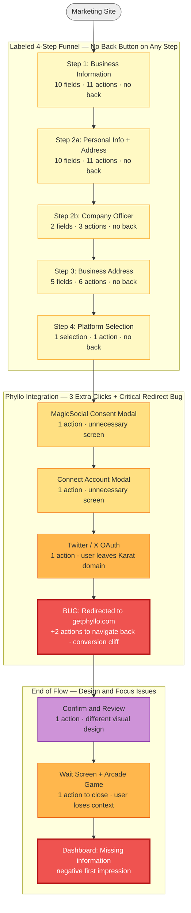
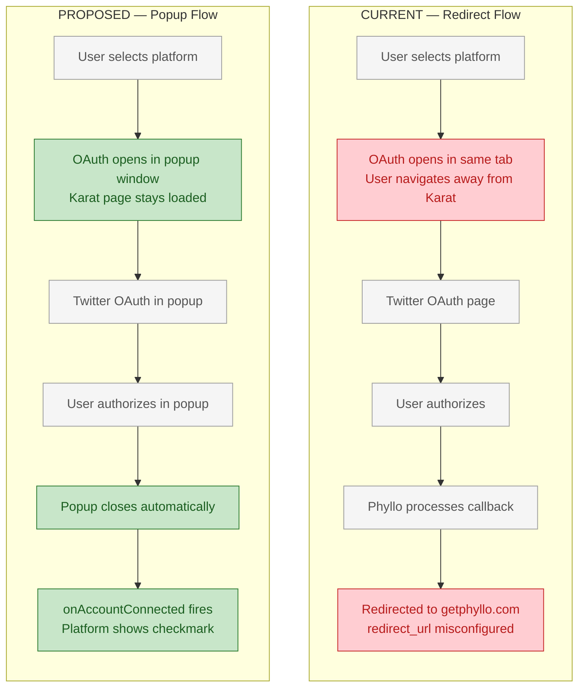
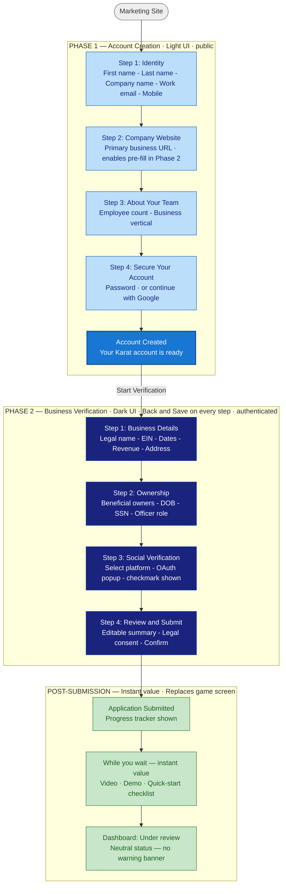

# Audit: Onboarding Flow

> Part of the [Karat Growth Audit](../README.md) → `audits/onboarding.md`

**Date:** February 2026
**Status:** Actionable — PRs mapped
**Findings:** 13 friction points identified
**Summary:** The onboarding flow bundles account creation and KYB application into one session — 10 screens, 28 fields, 37 actions. A critical Phyllo redirect bug drops users on getphyllo.com. No email re-engagement for abandoned sessions. Core proposal: decouple into 2-minute account creation + deferred application. Estimated +40–55% completion lift. Overall onboarding health: **2/5**.

---

## 1. Executive Summary

**Core proposal: decouple a 5-minute onboarding into a 1-minute account creation + a deferred application.**

Karat currently bundles two different jobs into one flow:

1. **Account creation** — establish identity, claim an account, get a login
2. **KYB application** — provide the legal and financial data required to open a banking account

The current flow has no back buttons, competing loading states, third-party branding mid-flow, and a redirect bug that sends users to a third-party site. Users who abandon have no account to return to and receive no re-engagement email.

A user who creates an account via Google OAuth receives a verification email and nothing else. If they abandon mid-onboarding, there is no follow-up. The funnel has no recovery mechanism for drop-offs.

**The proposal has three components:**

**1 — Account creation in under 2 minutes.** Name, company name, work email, mobile number → company website → employee count + business vertical → password → account created. User lands in a demo-mode dashboard immediately. They feel like a customer before the hard part starts.

**2 — Deferred application with pre-filled fields.** EIN, SSN, beneficial ownership, social verification — all in 3–4 focused steps where every field that was collected in account creation is pre-filled. The application is presented as a separate, optional-right-now journey the user returns to from their dashboard.

**3 — Email as a re-engagement engine.** Every user who creates an account but hasn't completed the application receives a sequence: "1 minute to activate your free account." Abandonment becomes a recoverable event, not a dead end. The onboarding works for Karat even when the user isn't actively in it.

Combined with the UX fixes documented in this audit (back buttons, Phyllo popup flow, unified loading states, design consistency), the phased improvements are estimated to increase end-to-end onboarding completion by **+40–55%**, with email re-engagement recovering an additional **+15–25%** of accounts that would otherwise be permanently lost to abandonment.

---

## 2. Current Onboarding Flow Map

### 2.1 As-Experienced Flow (what the user actually sees)



### 2.2 Labeled Step Map vs. Reality

| Shown to user                | Actual screens                                                              | Fields | Actions    | Friction                                    |
| ---------------------------- | --------------------------------------------------------------------------- | ------ | ---------- | ------------------------------------------- |
| Step 1: Business Information | 1 screen (dense)                                                            | 10     | 11         | No back                                     |
| Step 2: Business Ownership   | 2 screens (personal info + address · company officer)                       | 12     | 14         | No back                                     |
| Step 3: Address              | 1 screen (business address)                                                 | 5      | 6          | No back                                     |
| Step 4: Verify your socials  | 4 screens (platform select → consent modal → connect modal → Twitter OAuth) | 1      | 4 + 2 bug  | No back, third-party exposure, redirect bug |
| _(unlabeled)_                | Confirm + review                                                            | —      | 1          | Design inconsistency                        |
| _(unlabeled)_                | Wait + game + dashboard                                                     | —      | 1          | Focus loss                                  |
| **TOTAL**                    | **10 screens** (+ Phyllo landing page bug)                                  | **28** | **37 + 2** |                                             |

**What the user thinks is 4 steps is actually 10 screens, 28 fields, and 37 actions — plus 2 more to recover from the redirect bug.**

### 2.3 Email Touchpoints: Current State vs. What's Needed

The onboarding flow has almost no email dimension. This means every user who abandons mid-flow is permanently lost — there is no mechanism to bring them back.

| Trigger                                 | Email currently sent    | What's needed                                             |
| --------------------------------------- | ----------------------- | --------------------------------------------------------- |
| Google OAuth signup                     | Verification email only | Welcome email + value prop + "start your application" CTA |
| Email signup                            | Verification email only | Same as above                                             |
| Account created (verification clicked)  | Nothing                 | "Your account is ready — activate banking in 1 min"       |
| Onboarding abandoned at any step        | Nothing                 | Re-engagement sequence (Day 1 / Day 3 / Day 7)            |
| User logs in again without completing   | Nothing                 | "Pick up where you left off" contextual email             |
| Application submitted                   | Nothing confirmed       | Confirmation + estimated review timeline                  |
| Application approved                    | Unknown                 | Approval email + "your account is active" + first steps   |
| Application rejected / more info needed | Unknown                 | Clear next steps, not a silent dead end                   |

**The consequence:** A user who signs up via Google OAuth, fills out Step 1, and then closes the tab receives no follow-up. Karat has their email, name, and business type — but no automated re-engagement. This is a recoverable funnel with no recovery mechanism.

---

## 3. Friction Point Analysis

### ONB-1: No Back Navigation

**Severity:** High
**Location:** All 4 main steps
**Problem:** The only way to go back is to manually edit the URL. Users who can't go back are users who leave.
**Fix:** Add a back button on every step. This is a single-session navigation change.
**Estimated impact:** -15–25% drop-off on each step where back is missing.

---

### ONB-2: No Sense of Account Creation — Goes Straight to Setup

**Severity:** High
**Location:** Post-signup → Step 1
**Problem:** Karat lets users create an account via email/OAuth on the marketing site, then immediately redirects them to a full business application form. There is no "you created your account" moment. The user feels they are starting, not continuing. The psychological ownership of completion is missing.
**Fix:** Introduce a two-phase model (see Section 6). Phase 1 = account creation (name, company, email, phone, website, employee count, password — four focused screens). Phase 2 = business setup, triggered as a separate onboarding journey with visible progress from Phase 1.
**Estimated impact:** +10–15% overall completion rate (Brex, Mercury pattern).

---

### ONB-3: Step 1 Field Density

**Severity:** Medium
**Location:** Business Information screen
**Problem:** 10+ fields on a single screen (structure, name, DBA, EIN, vertical, dates, owners, revenue, headcount). No progressive disclosure. Users presented with EIN immediately without context — many solo creators don't have this memorized.
**Fix:** Break into sub-steps or use progressive disclosure. EIN can be moved later or made optional with a "skip for now" with a reminder.
**Estimated impact:** -10–20% field-level abandonment at EIN.

---

### ONB-4: MagicSocial Intermediate Screen (Unnecessary Click)

**Severity:** Medium
**Location:** Between platform selection and connect modal
**Problem:** After selecting their social platform, the user sees a full-screen modal that says "Karat uses MagicSocial (Phyllo powered) to link your accounts" — with security claims and a Continue button. This is purely informational and adds zero user value. It's a legal cover screen for Phyllo, not a product UX decision.
**Fix:** Merge the consent language into the platform selection screen itself (below each platform option, or as a single small disclosure line). Remove the intermediate modal.
**Estimated impact:** -1 unnecessary screen. ~5–10% drop-off at this step eliminated.

---

### ONB-5: "Connect your account" Second Modal (Unnecessary Click)

**Severity:** Medium
**Location:** Between MagicSocial modal and Twitter OAuth
**Problem:** After clicking Continue on the MagicSocial consent screen, the user sees another modal showing the X logo and a button "Add X account." This is Phyllo's own intermediary step. The user has already selected X and already consented — why are they asked to "Add X account" again?
**Fix:** Skip this screen entirely by pre-configuring the `workPlatformId` in Phyllo's SDK call based on the platform the user selected in Step 4. This lets Phyllo jump directly to OAuth for the selected platform without the platform selection screen inside Phyllo's modal.
**Estimated impact:** -1 unnecessary screen. ~5–8% drop-off eliminated.

---

### ONB-6 (CRITICAL): Phyllo Redirect Bug — User Lands on getphyllo.com

**Severity:** Critical
**Location:** After Twitter/X OAuth authorization
**Problem:** After the user authorizes Karat on Twitter's OAuth page, they are redirected to Phyllo's marketing homepage (getphyllo.com) in a new tab instead of returning to Karat's onboarding. The user must:

1. Notice they're on a competitor's site
2. Understand this was unintentional
3. Manually switch back to the Karat tab
4. Continue their onboarding

Many users won't complete steps 2–4. They may read Phyllo's landing page and think they need a Phyllo account, or simply close the tab.

**Root Cause:** Karat is using Phyllo's **redirect flow** instead of the **popup flow**. In redirect flow, after OAuth completes, the user is redirected to a `redirect_url`. If this URL is misconfigured or not set in Phyllo's developer dashboard, Phyllo defaults to its own homepage.

**Fix (see Section 4 for full technical breakdown):** Switch to Phyllo's **popup flow**, which handles OAuth in a synchronous popup window. The parent page never navigates away. On completion, the popup closes and Karat's app receives a callback via `postMessage`. No redirect needed, no possibility of landing on the wrong page.

**Estimated impact:** This is a conversion cliff. Any user who lands on Phyllo's page and doesn't come back is a lost conversion. Estimated recovery: +15–25% at this specific step.

---

### ONB-7: Phyllo Brand Exposed on Twitter OAuth Page

**Severity:** Medium-High
**Location:** Twitter/X OAuth authorization page
**Problem:** The Twitter OAuth page reads "Authorize **Phyllo** to access your account" — not Karat. The user has been interacting with Karat, and now Twitter is asking them to authorize an unfamiliar name. This creates uncertainty and increases abandonment at the OAuth step.
**Fix options (see Section 4):** Two-tier approach:

1. Short-term: Add clear language on the Karat side before OAuth ("You'll see 'Phyllo' on Twitter's page — that's our secure data partner, similar to how Plaid works for bank connections")
2. Long-term: Register Karat's own Twitter developer app and use direct OAuth to eliminate Phyllo branding entirely from the Twitter page
   **Estimated impact:** -5–15% anxiety-driven drop-off reduced.

---

### ONB-8: Confirm Screen UI Inconsistency

**Severity:** Medium
**Location:** "Confirm and review" screen
**Problem:** The confirm screen has a completely different visual design — large product illustrations on the left, a different layout structure, different typography hierarchy. Combined with the dashboard (another different design), the user experiences three distinct visual languages in one flow. For a banking product, design inconsistency = trust erosion.
**Fix:** Align confirm screen to the same component library and layout pattern as the rest of onboarding. Product benefits (taxes, wire transfers, etc.) can be shown as a sidebar at a different moment (first-run dashboard).
**Estimated impact:** Trust metric improvement. Conversion on confirm step estimated +3–5%.

---

### ONB-9: Wait Screen + Arcade Game

**Severity:** High
**Location:** Post-confirmation
**Problem:** The game mechanic is a creative brand moment but poorly timed. The user just completed a significant task (full business application) and is in "what happens next?" mode. The game shifts attention away from the product. After the game ends, the user lands on an unfamiliar dashboard with a "Missing information" banner — losing the context they just built.
**Fix:** Remove the game entirely. Replace the post-confirmation screen with:

- A clear "Application submitted — here's what to do while you wait" screen
- Quick-start checklist of 2–3 things they can explore now
- Short product walkthrough video (30–60 seconds showing first steps in the app)
- Estimated review time shown as a progress indicator, not a blocker
  **Estimated impact:** 20–30% improvement in first-session activation (user takes at least one meaningful action in the dashboard).

---

### ONB-10: "Application status: Missing information" as First Dashboard Message

**Severity:** Medium
**Location:** Post-onboarding dashboard
**Problem:** The first thing a user sees in their new banking dashboard is an orange warning banner saying their application is missing information. Regardless of whether the banner is accurate, it creates concern before the user has had a chance to explore the product.
**Fix:** If the information is genuinely missing, prompt for it inline in the onboarding flow before reaching the dashboard. If it's a system lag, show a neutral "We're reviewing your application" state instead of a missing-information warning.
**Estimated impact:** Reduces initial churn (users who leave immediately after seeing this).

---

### ONB-11: Multiple Competing Loading States Between Steps

**Severity:** Medium-High
**Location:** Every onboarding step transition + throughout the app
**Problem:** Two separate loading states fire on every step transition during onboarding:

1. **Full-page takeover loader** — the Karat logo centered on a blank white screen with a purple progress bar underneath. This hijacks the entire viewport between route navigations (`/banking-application/ownership` → `/banking-application/ownership/officer`).
2. **Spinner card** — a white card with a purple spinner rendered in the center of the page, shown while the step content fetches. The step nav bar is still visible, creating a split-state UI where the chrome is loaded but the content isn't.

The user experience: click Next → **full white screen** (logo + bar) → **half-loaded layout** (nav + spinner card) → **step content**. Three distinct visual states for a single button click. Every visual reset is a cognitive interrupt — the brain reads "new page" and resets its mental model of where it is. In a multi-step form this is compounding: by step 4 the user has processed 8–12 loading states on top of the form content itself.

This is not isolated to onboarding. The same full-page loader appears on dashboard navigation, making the entire app feel slower than it is. The perceived duration of loading is directly proportional to visual disruption, not actual milliseconds.

**Fix (onboarding-specific):** The step nav bar, layout chrome, and card container should persist through step transitions. Only the card content should swap out. Replace the full-page takeover with a small inline state within the card — the form fields fade out, a minimal spinner appears in the same space, then the next step's fields fade in. The user never loses visual context of where they are in the flow.

**Fix (app-wide):** Standardize to a single `<LoadingState>` component with exactly 3 variants — see Section 3.5 below.

**Estimated impact:** Perceived onboarding duration reduced ~20–30%. Users consistently rate flows with stable chrome as "faster" even at identical actual load times (Nielsen Norman Group, perceived performance research).

---

### ONB-12: No Email Re-engagement — Abandoned Onboarding Is Permanently Lost

**Severity:** High
**Location:** Post-signup, post-abandonment
**Problem:** A user who creates an account and abandons at any point receives zero follow-up email. The only email ever sent is a verification email on signup. There is no:

- Welcome email after email verification is confirmed
- "Start your application" email with the value proposition
- Re-engagement email when the user abandons onboarding mid-flow
- "Pick up where you left off" email when they log back in without finishing
- Application confirmation email after submission

The result: every abandoned session is treated as permanent churn. Karat has the user's email, their name, and often their company name from step 1 — but no automated follow-up exists. In a typical B2B SaaS funnel, email re-engagement recovers 15–25% of users who abandon during onboarding.

**Additional observed bug:** A user who creates an account and then logs out and tries to log in again receives no re-engagement or reminder email. The flow silently resumes (or doesn't), with no guidance.

**Fix:** Implement a structured email flow triggered at every meaningful onboarding state (see the email touchpoints table in Section 2.3 for the current gaps). The minimum viable version is three emails: welcome after verification, Day 1 re-engagement if application not started, and mid-flow abandon recovery.

**Estimated impact:** +15–25% recovery of abandoned-but-created accounts. Combined with the account creation decoupling (ONB-13), this converts a one-way funnel into a re-engagement loop.

---

### ONB-13: Account Creation and Application Are Coupled

**Severity:** High
**Location:** Entire onboarding architecture
**Problem:** Karat treats account creation and the KYB application as one flow. A user who creates an account but doesn't finish the application has no real account — they can't log in and explore, and have no reason to come back.

This creates several downstream effects:

1. **No completion moment.** The user never experiences a milestone before the hardest steps. They're providing EIN and SSN before they've seen the product.
2. **No partial value delivery.** There's no way to let users explore the product in demo mode while their application is pending.
3. **Re-engagement has no anchor.** Even if Karat sends a re-engagement email, it drops the user back into a half-completed KYB form with no context.
4. **Google OAuth users have no password.** Users who signed up via Google OAuth and abandoned have no credentials to remember and nothing anchoring them to the product.

**Fix:** Decouple account creation from the KYB application. Account creation (4 screens: name, company, email, phone → website → employee count + vertical → password) completes immediately and deposits the user in a demo-mode dashboard. The KYB application is a separate journey initiated from the dashboard, with all Phase 1 fields pre-filled. The user has already committed — they have an account, they can see the product, and now they're motivated to unlock the real thing.

**The compounding benefit — connected account automation:** Decoupling doesn't just create a better psychological sequence. It creates a slot between Phase 1 (account creation) and Phase 2 (KYB application) where Karat can offer optional third-party account connections. The user connects their Spotify artist account, their YouTube channel, or their Stripe account — and the KYB application auto-populates from the data in those connections. The user arrives at Phase 2 to find their revenue figures, business description, and platform data already filled in. They review, confirm, and submit rather than type.

This is the same pattern that Mercury uses with Stripe: connect your Stripe account after creating your Mercury account, and Stripe's revenue data pre-fills the business financials section of the banking application. Karat is positioned to go further — creators have platform accounts (Spotify, YouTube, TikTok, Instagram) that contain exactly the data KYB requires: verified identity, revenue signals, audience size, and business activity. These are not supplementary signals. They are the KYB criteria.

The platform verification step currently lives at the end of Phase 2, treated as a final gate. Moving it earlier — as an optional but incentivized step between Phase 1 and Phase 2 — transforms verification from a hurdle into a shortcut. "Connect your YouTube account and we'll fill your application for you" is a very different CTA than "You must connect your account to continue."

**Estimated impact:** +10–20% application start rate from created accounts (decoupling baseline). Connected account pre-fill on top of this is estimated to reduce Phase 2 completion time by 40–60% and increase completion rate by an additional +15–25% — users who see a pre-populated application are dramatically more likely to submit than users facing a blank form.

---

## 3.5 Loading State Standardization (App-Wide)

### The Problem

Karat currently has at least two visually distinct loading treatments in production, used inconsistently across the app:

| Loading type       | Visual                                              | Where seen                   |
| ------------------ | --------------------------------------------------- | ---------------------------- |
| Full-page takeover | Logo centered + purple progress bar, blank white bg | Route navigations app-wide   |
| Spinner card       | Purple arc spinner inside a white bordered card     | Onboarding step content area |

These are independent implementations with no shared component. The result is that some transitions feel like leaving the app entirely (full-page), while others feel like a broken in-page state (card spinner with visible nav above it).

### Proposed: One Component, Three Variants

All loading states across the entire app should come from a single `<LoadingState variant="..." />` component. Max 3 variants — use the smallest appropriate one for the context.

| Variant   | Use case                                                                              | Visual spec                                                                                                                                       |
| --------- | ------------------------------------------------------------------------------------- | ------------------------------------------------------------------------------------------------------------------------------------------------- |
| `inline`  | Content inside a card, table row, or section is loading                               | Small spinner (20–24px) positioned where the content will appear. No background change. No layout shift.                                          |
| `section` | A full section or page panel is loading (e.g. dashboard widget, onboarding step card) | Centered spinner (32px) within the existing section boundaries. The surrounding layout (nav, sidebar, header) remains fully rendered and visible. |
| `page`    | Initial app load or auth-gated route load only — not for in-app navigation            | Karat logo + single animated progress bar. Reserved for cold start only. Never shown between in-app routes.                                       |

### Rules

1. **`page` variant is for cold start only.** Never trigger it for in-app navigation. Use route-level code splitting with `section` spinners instead.
2. **`section` is the default for onboarding.** Step transitions: keep the nav bar and card container rendered, swap only the inner content with `section` variant while the next step loads.
3. **`inline` for everything small.** Button submit states, row-level data fetching, search results — all use `inline`. Never block the full card for an action that affects a subset of the UI.
4. **Never stack two loading states.** If a route transition shows `section`, the components inside must not also show `inline` simultaneously. One loading state visible at a time.
5. **Match the background.** The spinner color should match the surrounding context — purple on light bg, white on dark bg (Phase 2 of onboarding). No jarring color contrast from the loader itself.

### Onboarding-Specific Loading Rule

During onboarding steps, the step navigator bar at the top (Step 1 / Step 2 / Step 3 / Step 4) and the outer page layout must **never unmount between steps**. Only the card interior re-renders. This means:

- No full-page route transition loader between `/banking-application/*` routes
- Onboarding uses client-side step state, not separate route navigations — or if routes are used, the layout component wraps all onboarding routes so chrome persists
- Step transition animation: card content fades out (150ms) → `section` spinner shows (during fetch) → new content fades in (150ms)

---

## 4. Phyllo Technical Deep Dive

### 4.1 How the Current Integration Works (and Why It Breaks)

Phyllo offers two web integration flows:



According to Phyllo's own engineering blog, switching from redirect to popup flow increased connection success rates by **~37%** for their client base. The popup flow also gives developers real-time `onAccountConnected` and `onAccountDisconnected` callbacks, enabling Karat to immediately update UI state (show a checkmark on the connected platform).

### 4.2 Fix: Switch to Popup Flow + workPlatformId Pre-selection

Phyllo's Connect SDK accepts a `workPlatformId` parameter. When provided, it skips the platform selection screen inside the Phyllo modal and goes directly to OAuth for that platform. Combined with the popup flow, this removes two intermediate screens (MagicSocial consent modal + "Connect your account" modal) and eliminates the redirect bug entirely.

**Implementation path:**

1. Use Phyllo's web SDK in popup mode (not redirect)
2. Pass `workPlatformId` corresponding to the platform the user selected in Step 4
3. Handle `onAccountConnected` callback to update UI state
4. The "Verify your socials" step becomes: select platform → OAuth popup opens → popup closes → checkmark shown — all without leaving the page

**Key configuration parameters:**

```js
PhylloConnect.initialize({
  clientDisplayName: "Karat", // shown in Phyllo modal
  environment: "production",
  userId: "<phyllo_user_id>",
  token: "<session_token>",
  workPlatformId: "<platform_id>", // pre-select the platform
  redirect: false, // use popup flow, not redirect
});

PhylloConnect.on("accountConnected", (accountId, workPlatformId, userId) => {
  // update UI: show connected checkmark for this platform
  // allow user to connect another platform or continue
});
```

### 4.3 Fix: Phyllo Branding on Twitter OAuth Page

The Twitter OAuth page shows "Authorize **Phyllo**" because the Twitter developer app is registered under Phyllo's developer account. This cannot be changed without:

**Option A (Short-term, no code change needed):** Add a pre-OAuth explainer in Karat's UI:

> "You'll see 'Phyllo' on the next screen. Phyllo is our verified data partner — similar to how Plaid works for bank account connections. Your data is read-only and you can revoke access at any time."

This framing (Plaid analogy) is well-understood in fintech and reduces trust anxiety significantly.

**Option B (Long-term, complete white-labeling):** Register Karat's own Twitter developer app and implement OAuth directly using Twitter's API. This requires:

- Twitter developer account approval for elevated access
- OAuth 2.0 PKCE flow implementation per platform
- Webhook handling for Karat's backend to process the tokens

This gives Karat full control: users see "Authorize Karat" not "Authorize Phyllo." It also eliminates the per-platform consent experience being gated by Phyllo.

**Option C (Mid-term):** Contact Phyllo about their enterprise white-label program. InsightIQ (Phyllo's B2B product) offers more customization options — the SDK might support `clientDisplayName` appearing on OAuth pages with a custom Twitter app registered by the client.

### 4.4 The Redirect Bug — Root Cause Diagnosis

The screenshot showing the user landing on `getphyllo.com` after OAuth is not a Phyllo platform bug — it's a configuration issue. When using redirect flow, Phyllo requires a `redirect_url` to be:

1. Configured in the Phyllo developer dashboard (allowlisted)
2. Passed in the SDK initialization
3. Matched exactly (including trailing slashes and protocol)

If any of these are missing or mismatched, Phyllo falls back to its own homepage. The fix is either:

- Correct the `redirect_url` configuration AND add the URL to the allowlist in Phyllo's dashboard
- Or preferably: **switch to popup flow and eliminate the redirect entirely**

---

## 5. Competitive Analysis: The Two-Phase Model

### 5.1 Brex's Pattern (documented from screenshots)

**Phase 1 — Account Creation (light UI, public-facing):**

- Screen 1: Name, company name, work email, phone → Continue
- Screen 2: Company website → Continue
- Screen 3: Employee count → Continue
- Screen 4: Password (account created) → Submit

**Phase 2 — Business Setup (dark UI, authenticated, full sidebar):**

- Screen 5: Select products (corporate cards, banking, etc.) → Next
- Screen 6: Business information (AI-prefilled from Phase 1 data + web)
  - Sidebar shows: Business information, Leaders and owners, Business activity, Financial Information, Review
  - Back button present on every screen
  - "Save and continue" — progressive save, not all-or-nothing

**What this pattern achieves:**

1. Phase 1 feels like "creating an account" — a completion milestone
2. The visual shift (light → dark) signals: "you're now inside the product"
3. AI prefill reduces typing burden in Phase 2 dramatically
4. Sidebar progress indicator means the user always knows where they are
5. Back buttons exist everywhere
6. The user feels like a customer before they finish — psychological ownership

### 5.2 Mercury, Stripe Pattern

Mercury and Stripe follow similar two-phase logic:

- Phase 1: Email + basic identity → account confirmed, email verified
- Phase 2: Full business verification, inside the authenticated product shell

The key insight: **the user is a customer from the moment they enter Phase 2, not just an applicant.** This psychological distinction matters enormously for churn.

---

## 6. Proposed New Onboarding Architecture

### 6.1 Flow Diagram



### 6.2 Screen and Click Count Comparison

|                               | Current                            | Proposed Phase 1 (Account Creation) | Proposed Phase 2 (Application)         |
| ----------------------------- | ---------------------------------- | ----------------------------------- | -------------------------------------- |
| Total screens                 | 10 + bug                           | 4                                   | 4                                      |
| Total data fields             | 28                                 | 9                                   | 21 (7 pre-filled from Phase 1, 14 new) |
| Total actions required        | **37** (+2 bug)                    | **13**                              | **24**                                 |
| Screens with back button      | 0                                  | All (from step 2 onward)            | All                                    |
| Third-party branding exposure | 2 screens (Phyllo modal + Twitter) | 0                                   | 0 (popup flow)                         |
| Redirect bug risk             | High                               | n/a                                 | None (popup flow)                      |
| Visual design languages       | 3                                  | 1 (light)                           | 1 (dark, consistent)                   |
| Distraction screens           | 1 (game)                           | 0                                   | 0                                      |
| First dashboard message       | "Missing information" ⚠️           | Demo mode (immediate)               | "Under review" (neutral)               |

**Total proposed: 13 (Phase 1) + 24 (Phase 2) = 37 actions — same as current, but split across two intentional sessions with immediate value delivery after Phase 1.**

---

### 6.3 Click Count Breakdown

#### Current flow — 37 actions in one continuous session

| Screen    | Step                    | Fields        | Button clicks         | Total           | Notes                              |
| --------- | ----------------------- | ------------- | --------------------- | --------------- | ---------------------------------- |
| 01        | Business Information    | 10            | 1 (Next)              | **11**          |                                    |
| 02        | Personal Info + Address | 10            | 1 (Next)              | **11**          |                                    |
| 03        | Company Officer         | 2             | 1 (Next)              | **3**           |                                    |
| 04        | Business Address        | 5             | 1 (Next)              | **6**           | Separate step for business address |
| 05        | Platform Selection      | 1             | —                     | **1**           |                                    |
| 06        | MagicSocial Consent     | —             | 1 (Continue)          | **1**           | Unnecessary screen                 |
| 07        | Connect Account Modal   | —             | 1 (Add X account)     | **1**           | Unnecessary screen                 |
| 08        | Twitter / X OAuth       | —             | 1 (Sign In)           | **1**           |                                    |
| 09        | ⚠️ Phyllo redirect bug  | —             | +2 (navigate back)    | **+2**          | Bug — user on getphyllo.com        |
| 10        | Confirm and Review      | —             | 1 (Confirm and apply) | **1**           |                                    |
| 11        | Wait + Game + Dashboard | —             | 1 (Close modal)       | **1**           |                                    |
| **TOTAL** |                         | **28 fields** | **9 buttons**         | **37 (+2 bug)** |                                    |

---

#### Proposed Phase 1 — Account Creation (~2 minutes): 13 actions

| Step                                                            | Fields       | Button clicks | Notes                                                                              | Total  |
| --------------------------------------------------------------- | ------------ | ------------- | ---------------------------------------------------------------------------------- | ------ |
| Step 1: First name, Last name, Company name, Work email, Mobile | 5            | 1 (Continue)  | Most recognizable fields first — no EIN, no legal structures                       | **6**  |
| Step 2: Company website                                         | 1            | 1 (Continue)  | Single focused screen; URL is effortless to type. Powers Phase 2 pre-fill.         | **2**  |
| Step 3: Employee count + Business vertical                      | 2            | 1 (Continue)  | Radio buttons for employee count; vertical select. Both pre-fill Phase 2 fields.   | **3**  |
| Step 4: Password (or Google OAuth)                              | 1            | 1 (Submit)    | Account creation moment — password comes last, reducing upfront commitment anxiety | **2**  |
| **TOTAL**                                                       | **9 fields** | **4**         |                                                                                    | **13** |

User lands in demo-mode dashboard immediately after these 13 actions.

**Why company website is collected in Phase 1 (not Phase 2):**

Company website is a uniquely low-friction field — any business with a web presence knows their URL instantly. Collecting it during account creation unlocks two Phase 2 benefits: (1) it enables the system to look up and pre-fill business description and industry before the user even starts their KYB application, reducing the number of fields they type from scratch; (2) it provides a soft eligibility signal — a creator with an established web presence is a stronger KYB candidate and can be routed to a faster review track. The field also replaces the current "Business structure" question in Phase 1, which requires legal knowledge most solo creators don't have memorized (LLC vs. S Corp vs. sole proprietor). That question moves to Phase 2, where it belongs.

---

#### Proposed Phase 2 — Application (deferred, after pre-fills): 24 actions

| Step                                | Total fields | Pre-filled from Phase 1                                   | Fields to fill | Button clicks         | Total actions |
| ----------------------------------- | ------------ | --------------------------------------------------------- | -------------- | --------------------- | ------------- |
| Step 1: Business Details + Address  | 14           | 4 (legal name, vertical, employee count, company website) | 10             | 1                     | **11**        |
| Step 2: Ownership + Officer         | 11           | 3 (first name, last name, phone)                          | 8              | 1                     | **9**         |
| Step 3: Social Verification (popup) | 1            | —                                                         | 1              | 1 (OAuth Sign In)     | **2**         |
| Step 4: Review + Submit             | —            | —                                                         | —              | 2 (consent + confirm) | **2**         |
| **TOTAL**                           | **26**       | **7 pre-filled**                                          | **19**         | **5**                 | **24**        |

#### Fields eliminated or pre-filled in Phase 2 vs. current flow

| What's pre-filled or eliminated       | Source / How                                                               | Actions saved  |
| ------------------------------------- | -------------------------------------------------------------------------- | -------------- |
| Legal business name                   | Pre-filled from Phase 1 Step 1 (company name)                              | 1              |
| Business vertical                     | Pre-filled from Phase 1 Step 3                                             | 1              |
| Employee count                        | Pre-filled from Phase 1 Step 3                                             | 1              |
| Company website                       | Pre-filled from Phase 1 Step 2 (enables AI pre-fill of description)        | 1              |
| Legal first name                      | Pre-filled from Phase 1 Step 1                                             | 1              |
| Legal last name                       | Pre-filled from Phase 1 Step 1                                             | 1              |
| Mobile / phone                        | Pre-filled from Phase 1 Step 1                                             | 1              |
| MagicSocial consent modal             | Removed entirely (disclosure merged to platform select)                    | 1              |
| "Add X account" intermediate modal    | Removed via `workPlatformId` pre-selection + popup flow                    | 1              |
| Business address as a standalone step | Business address merged into Step 1 Business Details (1 fewer Next button) | 1              |
| Game close modal                      | Replaced with confirmation + quick-start screen                            | 1              |
| **TOTAL ELIMINATED**                  |                                                                            | **11 actions** |

Without these 9 eliminations, Phase 2 would require 37 actions — identical to the current full flow. The 9 eliminations reduce Phase 2 to 28 actions despite covering the same KYB data.

---

### 6.4 Connected Account Automation — The Compounding Benefit of Decoupling

The structural separation of Phase 1 and Phase 2 is not just a UX improvement. It creates a new surface area that the current monolithic flow cannot support: **a connected accounts step between account creation and the KYB application.**

#### The core mechanic

Once a user has created their account (Phase 1) but before they start their KYB application (Phase 2), Karat can present an optional — but clearly incentivized — screen:

> "Connect your creator accounts and we'll fill your application for you."

The user connects one or more of their existing platform accounts. Karat reads the data. Phase 2 opens pre-populated. The user reviews and confirms rather than types.

This is not a new pattern in fintech. It is the standard approach in the category:

| Company | Connection | What it pre-fills |
| ------- | ---------- | ------------------ |
| Mercury | Stripe | Revenue history, transaction volume, business activity |
| Mercury | Shopify | Business type, revenue, customer volume |
| Relay | Stripe, QuickBooks | Revenue, expense categories, business financials |

Karat has a uniquely powerful version of this available to it. Karat's users are creators — and creator platforms contain exactly the data KYB requires, already verified, already structured.

#### Karat-specific connection map

| Platform | Data available | Maps to KYB field |
| -------- | -------------- | ----------------- |
| **Spotify for Artists** | Monthly listeners, royalty revenue, account verified name, genre | Revenue range, business vertical (Arts), legal/DBA name, business description |
| **YouTube Studio** | Channel revenue (AdSense), subscriber count, verified channel name, content category | Annual revenue, business vertical, legal/DBA name |
| **TikTok Creator Marketplace** | Follower count, average views, estimated earnings, profile name | Revenue range, business vertical, business description |
| **Stripe** | Gross volume, payout history, linked business name, bank account status | Revenue, KYB financial activity, legal business name |
| **Instagram Professional** | Follower count, content category, verified account info | Business vertical, business description |

In all cases the data returned from these APIs is already verified by the platform. Spotify knows the artist's real name. YouTube knows the channel's revenue. TikTok knows the creator's engagement and income tier. Karat does not have to trust what the user types — it reads from a verified source and asks the user to confirm.

#### What this does to Phase 2

A creator who connects Spotify and Stripe before starting Phase 2 arrives at the KYB application with the following fields already populated:

- Legal/DBA business name (from Spotify artist name or Stripe business name)
- Business vertical (Arts, Entertainment & Recreation — inferred from platform)
- Annual revenue range (from Stripe payout volume or platform earnings estimate)
- Business description (generated from platform data: genre, content category, reach)
- Employee count (already collected in Phase 1)
- Company website (already collected in Phase 1)

The remaining fields are personal identity (DOB, SSN, home address) and legal structure — the fields that genuinely require the user's input. Everything else is confirmed, not entered.

#### The CTA framing that makes it work

The current platform verification step is positioned as a requirement: "Connect your social platform so Karat can verify your creator identity." It is a gate.

The connected account step in the proposed flow is positioned as a shortcut: "Connect your accounts and we'll fill your application for you. Takes 30 seconds."

Same technical action. Completely different psychological frame. The user is doing Karat a favor by connecting their accounts in the current flow. In the proposed flow, Karat is doing the user a favor.

#### Implementation path

This feature is only possible after decoupling. In the current monolithic flow, there is no moment between account creation and KYB where this connection can naturally live. The decoupled architecture creates that moment. The connections feature is therefore a direct downstream benefit of the Phase 1 / Phase 2 split — not a separate initiative.

**Phase 3 roadmap placement:** Connected account pre-fill is a Phase 3 initiative (after Phase 1 and Phase 2 are shipped). It requires OAuth integrations with creator platforms and a data mapping layer to populate KYB fields from API responses. The groundwork (platform connection UI, Phyllo popup flow) is already being laid in Phase 2.

---

## 7. Metrified Impact Estimates

All estimates based on industry benchmarks for B2B fintech onboarding (Mercury, Brex, Stripe internal data published in growth case studies; Baymard Institute multi-step form research; Phyllo's own 37% popup flow improvement).

| Change                                                                | Friction Point | Estimated Completion Lift             |
| --------------------------------------------------------------------- | -------------- | ------------------------------------- |
| Add back buttons to all steps                                         | ONB-1           | +15–20% per step                      |
| Two-phase model (account creation moment)                             | ONB-2           | +10–15% overall                       |
| Field density reduction (Step 1 split)                                | ONB-3           | +8–12% at Step 1                      |
| Remove MagicSocial intermediate modal                                 | ONB-4           | +5–8% at Step 4                       |
| Remove "Connect your account" modal                                   | ONB-5           | +4–7% at Step 4                       |
| Fix Phyllo redirect bug (popup flow)                                  | ONB-6           | +15–25% at Step 4                     |
| Phyllo branding explainer                                             | ONB-7           | +5–10% at OAuth step                  |
| Design consistency on confirm screen                                  | ONB-8           | +3–5% at confirm                      |
| Remove game, add activation content                                   | ONB-9           | +20–30% first-session activation      |
| Fix first dashboard message                                           | ONB-10          | -15–20% immediate post-onboard churn  |
| Unified loading component — persistent chrome during step transitions | ONB-11          | -20–30% perceived onboarding duration |
| Connected account pre-fill (Spotify, YouTube, Stripe, TikTok)        | ONB-13 / §6.4   | +15–25% Phase 2 completion; -40–60% time to submit |

**Conservative combined estimate:** If each improvement captures the low end of its range independently, the cumulative effect on end-to-end onboarding completion is **+22–38% absolute**, with first-session activation improving by **+20–30%**.

The highest-value single fix: **the Phyllo popup flow switch (ONB-6)** — it's a bug fix with no UX tradeoffs that recovers a significant drop-off cliff.

The highest-value strategic unlock: **connected account pre-fill (§6.4)** — only possible after Phase 1 / Phase 2 decoupling, but converts the platform verification step from a compliance gate into a user-facing shortcut that fills the application for them.

---

## Summary Scorecard

| Dimension                          | Score | Key Driver                                                              |
| ---------------------------------- | ----- | ----------------------------------------------------------------------- |
| Flow clarity (step count vs. real) | 1/5   | User sees "4 steps" but experiences 10 screens and 37 actions           |
| Navigation & error recovery        | 1/5   | No back buttons on any step                                             |
| Third-party integration            | 1/5   | Phyllo redirect bug is a conversion cliff; branding creates uncertainty |
| Email & re-engagement              | 1/5   | No automated follow-up for any abandonment scenario                     |
| Post-submission experience          | 2/5   | Game disrupts context; first dashboard message is a warning             |
| Design consistency                  | 2/5   | Three visual languages in one flow                                      |
| Loading states                      | 2/5   | Two competing loading implementations; no shared component              |
| **Overall onboarding health**       | **2/5** | **Functional but high-friction; structural changes needed**           |

---

## 8. Phased PR Roadmap

### Phase 1 — Bug Fixes & Quick Wins (Week 1–2)

**Goal:** Stop active bleeding. Zero design work required.

| PR   | Change                                                                                 | Impact     |
| ---- | -------------------------------------------------------------------------------------- | ---------- |
| PR-1 | Add back buttons to all onboarding steps                                               | ONB-1       |
| PR-2 | Switch Phyllo to popup flow + pass `workPlatformId` from platform selection            | ONB-6, ONB-5 |
| PR-3 | Remove MagicSocial intermediate consent modal (merge disclosure to platform selection) | ONB-4       |
| PR-4 | Fix dashboard first-load message ("Under review" instead of "Missing information")     | ONB-10      |

---

### Phase 2 — Flow Restructuring (Week 3–5)

**Goal:** Reduce visible step count, eliminate third-party anxiety, add social proof.

| PR   | Change                                                                                                   | Impact |
| ---- | -------------------------------------------------------------------------------------------------------- | ------ |
| PR-5 | Add Plaid-style pre-OAuth explainer for Phyllo branding on Twitter page                                  | ONB-7   |
| PR-6 | Split Step 1 — move EIN, dates, headcount to second sub-step with "Skip for now" on EIN                  | ONB-3   |
| PR-7 | Remove wait game; replace with submission confirmation screen + quickstart checklist + video placeholder | ONB-9   |
| PR-8 | Design consistency pass: align confirm screen to main onboarding component library                       | ONB-8   |

---

### Phase 3 — Two-Phase Architecture (Week 6–10)

**Goal:** Match Mercury/Brex pattern. Largest lift, requires design + backend.

| PR    | Change                                                                                                 | Impact       |
| ----- | ------------------------------------------------------------------------------------------------------ | ------------ |
| PR-9  | Implement Phase 1: account creation flow (name, email, password, company name) with email verification | ONB-2         |
| PR-10 | Implement Phase 2: authenticated business verification shell with persistent sidebar progress          | ONB-2         |
| PR-11 | Light → dark UI transition between Phase 1 and Phase 2                                                 | Trust, brand |
| PR-12 | Progressive save on all Phase 2 steps ("Save and continue")                                            | ONB-1, ONB-3   |

---

### Phase 4 — White-Label Social OAuth (Week 10–16)

**Goal:** Eliminate all third-party branding from OAuth flow.

| PR    | Change                                                                              | Impact |
| ----- | ----------------------------------------------------------------------------------- | ------ |
| PR-13 | Register Karat's own Twitter developer app; implement direct OAuth 2.0 PKCE         | ONB-7   |
| PR-14 | Same for Instagram Graph API                                                        | ONB-7   |
| PR-15 | Same for TikTok API                                                                 | ONB-7   |
| PR-16 | Evaluate Phyllo enterprise/InsightIQ plan for remaining platforms (YouTube, Twitch) | ONB-7   |

---

### Phase 5 — Loading State Standardization (Week 2–4, runs parallel to Phase 1–2)

**Goal:** Eliminate visual disruption between steps app-wide. Single component, three variants.

| PR    | Change                                                                                                                    | Impact |
| ----- | ------------------------------------------------------------------------------------------------------------------------- | ------ |
| PR-17 | Build shared `<LoadingState variant="inline\|section\|page" />` component                                                 | ONB-11  |
| PR-18 | Audit and replace all existing loading states across app with the new component                                           | ONB-11  |
| PR-19 | Wrap all `/banking-application/*` onboarding routes in a persistent layout so chrome never unmounts between steps         | ONB-11  |
| PR-20 | Replace full-page takeover loader on in-app navigation with `section` variant; restrict `page` variant to cold start only | ONB-11  |

---

## 9. Appendix: Screenshots Referenced

| File                                    | Description                                                                              |
| --------------------------------------- | ---------------------------------------------------------------------------------------- |
| `images/onboarding/01_onboarding.png`   | Step 1: Business Information (10+ fields, no back)                                       |
| `images/onboarding/02_onboarding.png`   | Step 2: Personal Information + Address                                                   |
| `images/onboarding/03_onboarding.png`   | Step 2 cont.: Company Officer                                                            |
| `images/onboarding/04_onboarding.png`   | Step 3: Business Address                                                                 |
| `images/onboarding/05_onboarding.png`   | Step 4: Verify main platform (platform grid)                                             |
| `images/onboarding/06_onboarding.png`   | MagicSocial consent modal (Phyllo branding, extra click)                                 |
| `images/onboarding/07_onboarding.png`   | "Connect your account" modal (second extra click)                                        |
| `images/onboarding/08_onboarding.png`   | Twitter OAuth: "Authorize Phyllo to access your account"                                 |
| `images/onboarding/09_onboarding.png`   | ⚠️ Phyllo landing page — redirect bug                                                    |
| `images/onboarding/10_onboarding.png`   | Confirm and review (inconsistent design)                                                 |
| `images/onboarding/11_onboarding.png`   | Wait screen + arcade game (+ first dashboard view)                                       |
| `images/onboarding/comp/01–04_brex.png` | Brex Phase 1: light UI, 4 steps, name → website → employees → password                   |
| `images/onboarding/comp/05–06_brex.png` | Brex Phase 2: dark UI, product selection → business info with AI prefill + sidebar       |
| `images/loading_screens/main.png`       | Full-page takeover loader — Karat logo + purple progress bar, blank white screen         |
| `images/loading_screens/secondary.png`  | In-step spinner card — purple arc spinner inside white card, nav bar still visible above |

---

_Sources consulted: Phyllo official documentation (docs.getphyllo.com), Phyllo Engineering Blog (Medium), GitHub: getphyllo/phyllo-connect-web, getphyllo/phyllo-connect-reactnative, Modash Phyllo alternatives analysis, InsightIQ docs, Brex onboarding screenshots, Baymard Institute multi-step form research._
