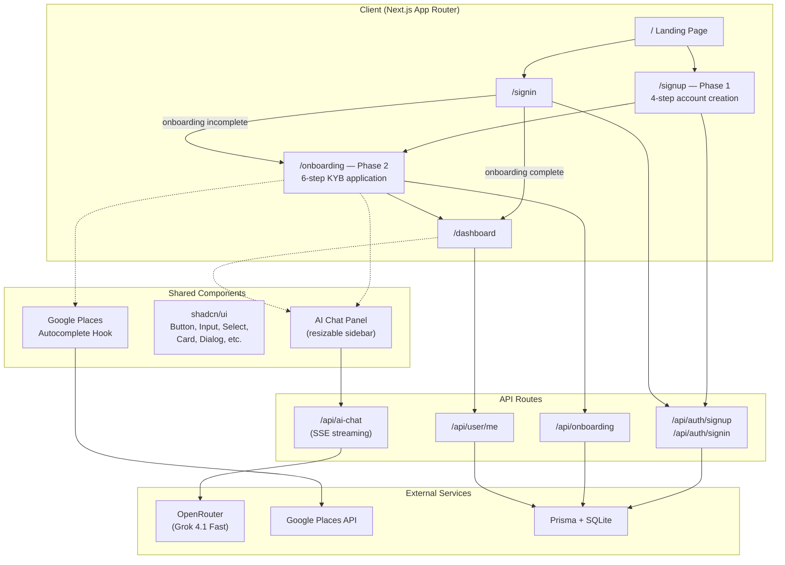

# Karat Onboarding Prototype

> UI playground resulting from the [Onboarding Audit](../audits/onboarding.md) — exploring what a decoupled, two-phase signup could look like.

This is **not** a production-ready app. It's a prototype for testing onboarding UX ideas — specifically the core proposal from the audit: **separate account creation from the KYB application** so users get an account in under 2 minutes and complete the business verification at their own pace.

---

## Two-Phase Onboarding

The audit found that Karat bundles account creation and the full KYB application into one session — 10 screens, 28 fields, 37 actions, no way back. Users who abandon mid-flow have no account, no re-engagement path, and no reason to return.

This prototype splits the flow into two distinct phases:

### Phase 1 — Account Creation (`/signup`)

Four lightweight steps to get the user into the product:

| Step | Fields | Purpose |
| ---- | ------ | ------- |
| 1 | Name, company, email, phone | Identity |
| 2 | Company website | Business context |
| 3 | Employee count, vertical | Segmentation |
| 4 | Password or Google OAuth | Credential |

**Result:** The user has an account. They can sign in, explore, and come back. Re-engagement emails have somewhere to point.

### Phase 2 — Business Verification (`/onboarding`)

Six steps for the full KYB application, completed from within the authenticated product:

| Step | Sidebar Label | Fields |
| ---- | ------------- | ------ |
| 1 | Business information | Structure, legal name, DBA, EIN, vertical, incorporation date/state, ownership, revenue, employees |
| 2 | Leaders and owners | Owner identity, DOB, SSN, personal address (Google Places autocomplete) |
| 3 | Leaders and owners | Company officer selection and title |
| 4 | Business address | Physical address (Google Places autocomplete), P.O. box restriction |
| 5 | Verify your socials | Connect TikTok, YouTube, Instagram, X, Twitch via Phyllo/MagicSocial |
| 6 | Review | Benefits summary, terms acceptance, submit |

**Key difference from current Karat:** Back buttons on every step. Progress sidebar. AI support. Users can leave and resume — the data is saved, the account persists.

---

## AI Assistant

An AI chat panel is available throughout onboarding and the dashboard. It answers questions about the process, Karat's products, and next steps — reducing the need to leave the flow.

- **Model:** Grok 4.1 Fast via OpenRouter
- **Streaming:** Server-Sent Events for real-time responses
- **Resizable:** 280px–800px sidebar
- **Contextual suggestions:** "How do I set up my business account?", "What are the AI bookkeeping features?", "How do I get a Karat credit card?"
- **Access:** "Support" button in onboarding header, "Ask AI" in dashboard

---

## Dashboard (`/dashboard`)

A mock banking dashboard showing what the user lands on after completing onboarding:

- Account overview with balance, card, and recent transactions
- AI bookkeeping banner
- P&L chart and spend categories
- Application status indicator
- Demo mode toggle (explore without real data)

---

## Key Features

- **Back navigation on every step** — addresses ONB-1 from the audit
- **Google Places autocomplete** — for personal and business addresses, reducing field friction
- **Platform verification modal** — redesigned Phyllo flow with pre-connection explainer (addresses ONB-5, ONB-6, ONB-7)
- **Dark theme onboarding** — distinct visual phase for the KYB flow, separating it from account creation
- **Progress sidebar** — 5 sidebar milestones map to 6 internal steps, so the user always knows where they are
- **Responsive design** — collapsible sidebar, mobile progress bar, adaptive layouts

---

## Architecture



---

## Tech Stack

| Layer | Technology |
| ----- | ---------- |
| Framework | Next.js 16.1.6 (App Router) |
| Language | TypeScript, React 19 |
| UI | shadcn/ui (New York), Radix UI, Tailwind CSS 4 |
| Database | Prisma 6.19 + SQLite |
| Auth | JWT + bcryptjs (prototype-only — not production auth) |
| AI | OpenRouter API → Grok 4.1 Fast |
| Maps | Google Places Autocomplete |
| Icons | Lucide React |

---

## Running Locally

```bash
cd my-app
cp .env.example .env       # See .env.example for what each variable does
npm install
npx prisma migrate dev
npm run dev
```

The defaults in `.env.example` are enough to run the full app locally — SQLite database, a dev-only JWT secret, and no external API keys required. The AI assistant and address autocomplete features need their respective keys (`OPENROUTER_API_KEY`, `NEXT_PUBLIC_GOOGLE_MAPS_API_KEY`), but the rest of the flow works without them.

> If you don't have an OpenRouter key, you can visit the deployed app to see the AI features in action.

**Security note:** The default `JWT_SECRET` is intentionally insecure for local testing. If you plan to deploy this anywhere, generate a proper secret (`openssl rand -base64 32`).

---

## Intentional Simplifications

This prototype is purposefully kept as UI boilerplate with minimal backend logic, so it's easy to run, test, and iterate on the flow without setup overhead. There is no real verification, no input validation, and no security hardening — you can click through the entire flow with empty fields.

**If this were to become a production-grade system, the following would need to be added:**

| Area | What's Missing | What to Add |
| ---- | -------------- | ----------- |
| Input validation | No field validation anywhere | Zod schemas for every form step — validate on blur (client) and on submit (server). Reject malformed EINs, SSNs, phone numbers, etc. |
| Rate limiting | No rate limiting on any endpoint | Redis-backed rate limiter (e.g. `@upstash/ratelimit`) on all API routes — especially `/api/auth/signin`, `/api/auth/signup`, and `/api/ai-chat` |
| Authentication | JWT stored in localStorage, no refresh tokens | HttpOnly cookie-based sessions, refresh token rotation, CSRF protection. Or use a managed provider (Clerk, NextAuth) |
| Authorization | No role checks, no middleware guards | Middleware-level auth checks on all protected routes and API endpoints |
| Database | SQLite, no connection pooling | PostgreSQL with connection pooling (Neon, Supabase, PlanetScale). Prisma Accelerate or pgBouncer for serverless |
| File uploads | None | Signed upload URLs (Vercel Blob, S3) for ID documents, business verification files |
| Error handling | Generic try/catch, no structured errors | Typed error responses, error boundaries on the client, Sentry or equivalent for monitoring |
| Email | No email infrastructure | Transactional email (Resend, SendGrid) for verification, re-engagement, application status updates |
| Secrets | `.env` with plaintext secrets | Vercel environment variables, secret rotation, no secrets in client bundles |
| Logging & observability | Console.log only | Structured logging, request tracing, performance monitoring |
| Accessibility | Not audited | WCAG 2.1 AA compliance, keyboard navigation, screen reader support |
| Testing | No tests | Unit tests for Zod schemas, integration tests for API routes, E2E tests (Playwright) for the full flow |

---

## Mapping to Audit Findings

This prototype addresses or demonstrates fixes for the following items from the [onboarding audit](../audits/onboarding.md):

| Finding | What This Prototype Does |
| ------- | ------------------------ |
| ONB-1 (No back navigation) | Back buttons on every step |
| ONB-2 (No account creation moment) | Phase 1 creates an account before KYB begins |
| ONB-3 (Step 1 field density) | Fields distributed across 4 signup steps + 6 onboarding steps |
| ONB-4 (MagicSocial intermediate screen) | Redesigned connection modal with context |
| ONB-5 (Second "Connect" modal) | Single-modal flow for platform verification |
| ONB-6 (Phyllo redirect bug) | Modal-based flow instead of redirect |
| ONB-7 (Phyllo brand on OAuth) | Pre-connection explainer screen |
| ONB-9 (Game disrupts context) | Replaced with review + confirmation step |
| ONB-10 (First dashboard message) | Dashboard shows status and next steps clearly |
| ONB-13 (Coupled account + application) | Decoupled into two distinct phases |
